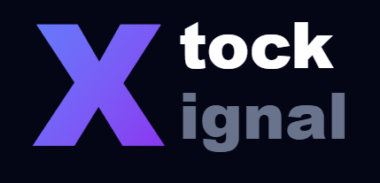

  

  # XTock-Xignal

  
  
  

  **AI를 활용한 지능형 금융 뉴스 캐싱 및 실시간 주식 거래 시스템**

---

## 📖 목차
1. [프로젝트 개요](#1-프로젝트-개요-project-overview)
2. [주요 기능](#2-주요-기능-key-features)
3. [기술 스택](#3-기술-스택-tech-stack)
4. [시스템 아키텍처](#4-시스템-아키텍처-system-architecture)
5. [설치 및 실행 방법](#5-설치-및-실행-방법-getting-started)

---

## 1. 프로젝트 개요 (Project Overview)

### 1.1 기획 배경 (Background)
현대 금융 시장에서 뉴스, 소셜 미디어 등의 비정형 텍스트 데이터는 주가 변동을 유발하는 핵심 촉매제 역할을 합니다. 그러나 초보 투자자들은 쏟아지는 글로벌 정보 속에서 어떤 뉴스가 자산 가격에 실질적인 영향을 미치는지 직관적으로 판단하기 어렵습니다. 

**XTock-Xignal**은 이러한 정보의 비대칭성을 해소하고, 투자 입문자들이 리스크 없이 글로벌 금융 시장의 거시적 흐름을 학습하며 투자 감각을 기를 수 있도록 돕는 **AI 기반 해외 금융 뉴스 큐레이션 및 모의투자 시뮬레이션 플랫폼**입니다.

### 1.2 프로젝트의 기술적 발전 과정 (Technical Evolution & Pivot)
본 프로젝트는 시스템의 실효성과 지속 가능성을 확보하기 위해 실제 고도화 과정에서 한 차례의 기술적 피벗을 거쳤습니다.

* **초기 기획 (비정형 텍스트 기반 주가 반응 분석):** 소셜 미디어(X, 구 트위터)의 실시간 데이터를 수집하여 금융 특화 NLP 모델(FinBERT) 및 의미 기반 기업 매칭(BGE-M3) 알고리션틀 통해 특정 텍스트 정보가 다음날 시장 수익률에 미치는 영향을 정량화·시각화하고자 했습니다.
* **직면한 한계 및 해결책:** 개발 초기 단계에서 핵심 데이터 소스인 X API의 급격한 유료화 및 무료 티어의 극단적인 호출 제한이라는 통제 불가능한 외부 제약에 직면했습니다. 과거 데이터를 활용하는 차선책을 검토했으나, 지연된 데이터로는 급변하는 금융 시장에 대응하는 실전 감각을 제공하기 어렵다는 결론을 내렸습니다.
* **최종 아키텍처 확정:** 이에 따라 정보의 신뢰성과 실시간성을 완벽히 보장할 수 있는 **글로벌 실시간 경제 뉴스 피드(Yahoo Finance, Finnhub API)**로 데이터 소스를 전면 교체했습니다. 더불어 해외 투자 시 가장 큰 진입 장벽인 언어 장벽 및 난해한 전문 용어 문제를 해결하기 위해 AI 번역과 인터렉티브 사전을 통합한 현재의 융합형 플랫폼으로 진화했습니다.

### 1.3 최종 목표 및 차별성 (Goals & Differentiation)
시중에 존재하는 기존 금융 서비스 및 시뮬레이터들과 비교하여 XTock-Xignal은 다음과 같은 확실한 차별성을 가집니다.

| 비교 대상 | 기존 서비스의 한계점 | **XTock-Xignal의 해결책** |
| :--- | :--- | :--- |
| **토스 증권 (모의투자)** | 이용 대상이 만 7세~18세 청소년으로 극히 제한적임 | 연령 제한 없이 **주식 시장에 입문하는 전 연령층**을 대상으로 서비스 제공 |
| **한국투자증권 (모의투자)** | 번거로운 실제 계좌 개설 및 복잡한 회원가입 절차가 필수적임 | 별도의 자산 연동 없이 **가상 자산을 통해 즉각적인 모의 매매 환경** 제공 |
| **기존 유사 플랫폼 (개미톡 등)** | 24시간 거래되는 암호화폐에만 국한되어 거시 경제 반영 미흡 | **S&P 500 등 글로벌 주식 시장의 실시간 데이터**와 동기화된 환경 구축 |
| **일반 금융 뉴스 포털** | 영문 기사의 언어 장벽 및 난해한 금융 전문 용어 해석의 어려움 | **AI 기반 실시간 번역, 3줄 요약 및 인터렉티브 용어 사전**을 통한 자기주도학습 지원 |

이를 통해 투자 입문자는 가상 자산을 활용해 손실 리스크 없이 투자 메커니즘을 체득할 수 있으며, 기존 투자자 또한 새로운 섹터나 종목에 진입하기 전 관련 뉴스를 학습하고 시뮬레이션을 선행함으로써 투자 위험성을 최소화할 수 있습니다.

---

## 2. 주요 기능 (Key Features)

### 1. 하이브리드 AI 기반 실시간 뉴스 큐레이션 및 파이프라인
* **증분 크롤링 (Incremental Crawling) 시스템:** 방대한 글로벌 금융 데이터 스트림이 메인 비즈니스 서버의 트래픽에 병목을 일으키지 않도록, 완전히 독립된 백그라운드 스케줄러를 구축했습니다. [Yahoo Finance](https://finance.yahoo.com/) 및 [Finnhub API](https://finnhub.io/)를 주기적으로 호출하되, 전체 데이터를 덮어쓰는 대신 '마지막 수집 시점 이후에 새로 발행된 기사'만 선별적으로 DB에 적재합니다. 이를 통해 네트워크 I/O 부하와 스토리지 낭비를 원천적으로 차단합니다.
* **로컬 NLP 엔진 기반 섹터 자동 분류:** 수집된 수천 건의 영문 기사는 외부 API로 전송되지 않고, 서버 인프라에 내장된 [Hugging Face](https://huggingface.co/) 기반의 **BERT(링크 추가 예정)** 모델로 즉시 전달됩니다. 해당 오픈소스 로컬 모델이 기사의 문맥을 분석하여 S&P 500 기준 산업군별로 자동 태깅을 수행합니다. 이는 외부 종속성 없이 실시간 필터링 속도를 극대화하는 1차 데이터 가공의 핵심입니다.

### 2. On-Demand 지능형 AI 사전 및 데이터 캐싱 (비용 최적화)
* **선택적 LLM 호출 아키텍처:** 실시간으로 쏟아지는 모든 경제 기사에 대해 무차별적으로 AI 요약 및 번역을 수행하면 막대한 상용 API([Google Gemini API](https://ai.google.dev/)) 과금과 한도 초과 문제가 발생합니다. 본 시스템은 이를 방지하기 위해 사용자가 '특정 기사의 상세 보기를 클릭'하거나 '모르는 전문 용어를 검색'하는 정확한 시점(On-Demand)에만 선택적으로 API를 호출하도록 설계되었습니다.
* **MongoDB 영구 캐시 적재:** 최초의 사용자에 의해 호출되어 생성된 한국어 3줄 요약본과 용어 해설 데이터는 반환 즉시 [MongoDB](https://www.mongodb.com/)의 Dictionary Collection에 영구 캐싱됩니다. 이후 다른 사용자가 동일한 단어나 기사를 조회할 경우, 외부 LLM 통신 없이 데이터베이스에서 즉각 응답합니다. 시스템 이용자가 증가할수록 데이터가 누적되어 전체적인 API 호출 비용이 0원에 수렴하게 만드는 지능형 캐싱 구조입니다.

### 3. 고성능 모의투자 시뮬레이션 엔진
* **경량화된 실시간 금융 시계열 렌더링:** 일반적인 DOM 기반 차트 라이브러리로 수천 건의 과거 주가 데이터와 실시간 틱 데이터를 렌더링할 경우 심각한 브라우저 메모리 누수와 프레임 드랍이 발생합니다. 이를 극복하기 위해 HTML5 Canvas 기반의 [Lightweight Charts](https://tradingview.github.io/lightweight-charts/) 라이브러리를 채택하여, 방대한 시계열 데이터를 실제 증권사 HTS(Home Trading System) 수준의 부드러운 UI로 렌더링합니다.
* **백엔드 주도 무결성 교차 검증:** 클라이언트 단의 데이터 조작(위변조)을 완벽히 차단하기 위해 매수/매도 로직은 철저히 백엔드([FastAPI](https://fastapi.tiangolo.com/)) 주도로 처리됩니다. 프론트엔드에서 매수 요청이 인입되면, 서버는 즉시 외부 API를 통해 해당 종목의 '실시간 현재가'를 다시 조회하고 MongoDB의 '현재 잔고'와 교차 검증합니다. 이후 잔고 차감과 포트폴리오 적재를 하나의 원자적 트랜잭션(Atomic Transaction)으로 묶어 처리하여 데이터 불일치를 방지합니다.

### 4. 전역 상태 동기화 기반 퀴즈 보상 시스템
* **Zustand 기반 실시간 UX 구현:** '금융 퀴즈를 통한 학습 보상'과 '모의투자 트레이딩 잔고'라는 별개의 컴포넌트 간 데이터 정합성을 유지하기 위해 [React](https://react.dev/) 전역 상태 관리 라이브러리인 [Zustand](https://zustand-demo.pmnd.rs/)를 도입했습니다. 복잡한 Props Drilling을 우회하는 중앙 상태 저장소(AccountStore)를 구축했습니다.
* **무지연(Zero-Latency) 상태 업데이트:** 사용자가 퀴즈 정답을 제출하여 백엔드 DB의 가상 자산이 증액되는 즉시, 프론트엔드의 스토어가 이를 감지합니다. 페이지 새로고침(Reload) 과정 없이 최상단 네비게이션 바의 '보유 자산'과 트레이딩 화면의 '매수 가능 금액'이 실시간으로 동기화되어 사용자에게 몰입감 있는 투자 시뮬레이션 경험을 제공합니다.
---

## 3. 기술 스택 (Tech Stack)

### Frontend
| 기술 | 도입 목적 및 활용 |
| :--- | :--- |
|  | **SPA 기반의 사용자 인터페이스 구축**: 컴포넌트 재사용성을 높이고, 모의투자 및 실시간 뉴스 피드의 동적 렌더링을 최적화하기 위해 도입했습니다. |
|  | **UI 와이어프레임 및 디자인 시스템**: 별도의 CSS 파일 병합 없이 유틸리티 클래스를 활용하여 트레이딩 화면의 복잡한 레이아웃을 신속하게 구축했습니다. |
|  | **전역 상태 관리 (Props Drilling 우회)**: 퀴즈 보상 시스템과 트레이딩 잔고 간의 실시간 데이터 동기화를 위해 사용하며, 무거운 Redux 대신 보일러플레이트가 적고 가벼운 Zustand를 채택했습니다. |
|  | **금융 시계열 렌더링 (메모리 누수 방지)**: 방대한 과거 주가 및 실시간 틱 데이터 렌더링 시 발생하는 프레임 드랍을 막기 위해 HTML5 Canvas 기반의 경량 차트 라이브러리를 사용했습니다. |

### Backend & Database
| 기술 | 도입 목적 및 활용 |
| :--- | :--- |
|  | **비동기 처리 및 API 게이트웨이**: 프론트엔드의 트레이딩 요청, 실시간 주가 검증, 크롤링 파이프라인 관리 등 시스템의 핵심 비즈니스 로직을 빠른 속도로 처리합니다. |
|  | **데이터 가공 및 백엔드 코어 연산**: 금융 데이터 스크래핑, 외부 API 통신, AI 파이프라인 연동을 위한 메인 언어로 사용되었습니다. |
|  | **지능형 캐싱 및 비정형 데이터 적재**: NoSQL의 유연한 스키마 구조를 활용하여 AI가 생성한 비정형 해설 데이터를 캐싱하고, 유저의 자산 및 포트폴리오를 관리합니다. |

### AI Pipeline & Data Source
| 기술 | 도입 목적 및 활용 |
| :--- | :--- |
|  | **On-Demand 문맥 요약 및 번역**: 사용자가 요청한 시점에만 제한적으로 호출되어 난해한 금융 기사의 3줄 요약 및 전문 용어 해설을 수행하는 LLM 엔진입니다. |
|  | **로컬 기반 섹터 자동 분류**: API 호출 비용 없이 수집된 기사의 문맥을 파악하여 S&P 500 기준의 산업군을 실시간으로 자동 태깅하는 오픈소스 NLP 엔진입니다. |
|  | **실시간 데이터 스트림**: 프로젝트의 가장 핵심적인 데이터 소스로, 글로벌 경제 뉴스 피드와 실시간 종목 주가 데이터를 제공받는 데 사용됩니다.
---

## 4. 시스템 아키텍처 (System Architecture)
(시스템 아키텍처 내용 작성...)

---

## 5. 설치 및 실행 방법 (Getting Started)
(설치 및 실행 방법 내용 작성...)