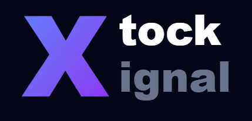
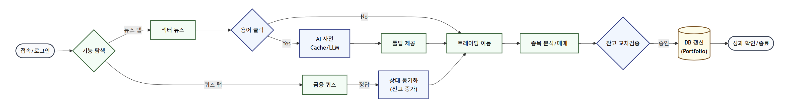
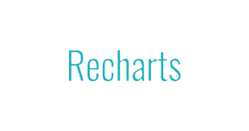
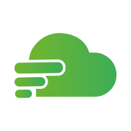
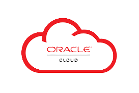
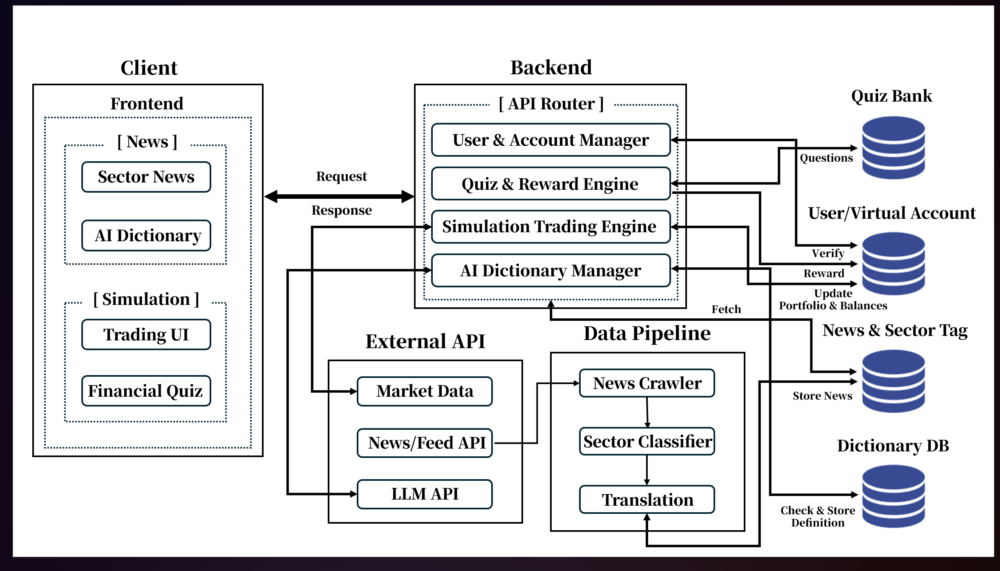

<div align="center">
  

  # Xtock-Xignal

  [](https://nextjs.org/)
  [](https://fastapi.tiangolo.com/)
  [](https://www.mongodb.com/)
  [](https://recharts.org/)
  [](https://vercel.com/)
  [](https://www.oracle.com/cloud/)
  [](http://xtock-xignal.kro.kr)

  **AI를 활용한 지능형 금융 뉴스 캐싱 및 실시간 주식 거래 시스템**

  ### 🌐 [http://xtock-xignal.kro.kr](http://xtock-xignal.kro.kr)
</div>

---

## 📖 목차
1. [프로젝트 개요](#1-프로젝트-개요-project-overview)
2. [핵심 서비스 흐름](#2-핵심-서비스-흐름-core-workflow)
3. [기술 스택 및 엔지니어링 전략](#3-기술-스택-및-엔지니어링-전략-tech-stack--engineering-strategy)
4. [시스템 아키텍처](#4-시스템-아키텍처-system-architecture)
5. [설치 및 실행 방법](#5-설치-및-실행-방법-getting-started)

---

## 1. 프로젝트 개요 (Project Overview)

### 1.1 기획 배경 (Background)
현대 금융 시장에서 뉴스 등 비정형 텍스트 데이터는 주가 변동을 유발하는 핵심 촉매제입니다. 그러나 초보 투자자들은 쏟아지는 글로벌 정보 속에서 어떤 뉴스가 자산 가격에 실질적인 영향을 미치는지 직관적으로 판단하기 어렵습니다. 
**XTock-Xignal**은 이러한 정보의 비대칭성을 해소하고, 투자 입문자들이 리스크 없이 글로벌 거시 경제의 흐름을 학습하며 투자 감각을 기를 수 있도록 돕는 **AI 기반 해외 금융 뉴스 큐레이션 및 모의투자 시뮬레이션 플랫폼**입니다.

### 1.2 프로젝트의 기술적 발전 과정 (Technical Pivot)
* **초기 기획:** 소셜 미디어(X) 데이터를 수집하여 금융 특화 NLP 모델로 주가 반응을 정량화하는 파이프라인 구상.
* **한계 직면:** 핵심 데이터 소스인 X API의 유료화 및 극단적인 호출 제한으로 인해 실시간성 보장 불가 판정.
* **최종 전환:** 정보의 신뢰성과 실시간성을 완벽히 보장하는 **글로벌 실시간 경제 뉴스 피드**로 데이터 소스 전면 교체. 해외 투자의 진입 장벽인 언어 및 전문 용어 문제를 해결하기 위해 AI 인터렉티브 사전을 통합한 현재의 시뮬레이션 플랫폼으로 진화했습니다.

### 1.3 기존 서비스와의 차별성 (Differentiation)
| 비교 대상 | 기존 서비스의 한계점 | **XTock-Xignal의 해결책** |
| :--- | :--- | :--- |
| **토스 증권 / 한국투자증권** | 연령 제한(청소년 한정) 또는 복잡한 계좌 개설 필수 | **전 연령층 대상**, 가상 자산을 통한 즉각적 모의 매매 환경 제공 |
| **기존 유사 플랫폼 (개미톡 등)**| 24시간 거래되는 암호화폐 시장에만 국한됨 | **S&P 500 등 글로벌 주식 시장**의 거시 경제 데이터 동기화 |
| **일반 금융 뉴스 포털** | 영문 기사의 언어 장벽 및 금융 전문 용어 해석 난해 | **AI 기반 실시간 3줄 요약 및 인터렉티브 용어 사전** 지원 |

---

## 2. 핵심 서비스 흐름 (Core Workflow)

XTock-Xignal은 단순한 정보 제공을 넘어 **[정보 습득 ➔ 자산 획득 ➔ 실전 투자]**가 하나의 유기적인 흐름으로 이어지도록 설계되었습니다.
<div align="center">
  
</div>

1. **지능형 뉴스 피드:** 사용자는 S&P 500 산업군별로 자동 분류된 글로벌 경제 뉴스를 실시간으로 탐색합니다.
2. **AI 인터렉티브 사전:** 기사 내 난해한 영문 전문 용어를 클릭하면 AI가 초보자 눈높이의 해설을 즉시 제공합니다. 동일 용어는 MongoDB에 영구 캐싱되어 이후 요청은 Gemini API 호출 없이 즉시 응답합니다.
3. **학습 보상 시스템:** 학습 센터에서 금융 용어를 학습하고 Gemini API가 생성한 AI 퀴즈에 참여합니다. 퀴즈는 로그인 시마다 `quiz_bank` DB에 누적 생성되어 매번 새로운 문제를 제공합니다. 정답 시 가상 투자 자산(Seed Money)을 획득하며, 매일 출석 체크 보상도 지급됩니다.
4. **실전 모의투자:** 획득한 자산으로 실제 증권사와 동일한 환경의 트레이딩 룸에서 글로벌 주식을 리스크 없이 매매합니다.
5. **백테스팅:** 과거 특정 시점에 주식을 매수했다면 현재 얼마가 되었을지 이동평균 크로스 전략 기반으로 시뮬레이션합니다.

---

## 3. 기술 스택 및 엔지니어링 전략 (Tech Stack & Engineering Strategy)

단순한 기능 구현을 넘어 대규모 데이터의 **처리 속도 최적화, 무결성 확보, 그리고 API 통신 비용 절감**을 목표로 아래와 같은 기술 스택을 채택했습니다.

### Frontend
| 기술 | 엔지니어링 전략 및 활용 |
| :---: | :--- |
|  | **메인 프레임워크**: React 기반 SPA 구조로 구성되며, Next.js의 라우팅 및 빌드 최적화를 활용. Turbopack 기반 개발 서버로 빠른 HMR 지원. |
|  | **UI/UX 구축**: 유틸리티 클래스를 활용하여 복잡한 트레이딩 화면의 레이아웃을 신속하게 렌더링. |
|  | **HTTP 통신**: Promise 기반 비동기 API 호출로 백엔드와의 데이터 통신을 처리. |
|  | **OHLC 차트 렌더링**: ComposedChart 기반 캔들스틱 + 이동평균(MA) 복합 차트로 실시간 주가 및 과거 데이터를 시각화. |

### Backend & Database
| 기술 | 엔지니어링 전략 및 활용 |
| :---: | :--- |
|  | **비동기 체결 엔진 및 API 게이트웨이**: 클라이언트의 조작을 원천 차단하기 위해 유저 매수 요청 시 서버가 직접 외부 주가를 조회하고 잔고를 교차 검증(Cross-validation)하는 로직 수행. WebSocket을 통한 실시간 주가 스트리밍 지원. |
|  | **백엔드 코어 연산**: feedparser 기반 RSS 크롤링, newspaper3k 본문 추출, deep-translator 번역 파이프라인 통합. |
|  | **다목적 영구 저장소**: AI 해설(`financial_terms`), 사용자 포트폴리오(`simulation_portfolios`), AI 생성 퀴즈(`quiz_bank`) 등 목적별 컬렉션으로 분리하여 관리. 동일 단어 재요청 시 LLM 호출 없이 즉각 응답하여 API 비용 절감. |

### AI Pipeline & Data Source
| 기술 | 엔지니어링 전략 및 활용 |
| :---: | :--- |
|  | **On-Demand 문맥 요약 & AI 퀴즈 생성**: 금융 용어 해설은 사용자 요청 시점에만 호출하여 과금 방지. 로그인 시 학습 센터 용어 기반으로 다양한 유형의 퀴즈를 생성하여 `quiz_bank` DB에 중복 없이 누적 저장. |
|  | **메인 뉴스 & 주가 데이터 소스**: feedparser로 Yahoo Finance RSS를 증분 수집하고, yfinance로 실시간 호가 및 OHLC 이력 데이터를 조회. |
|  | **보조 뉴스 파이프라인 (선택)**: `FINNHUB_API_KEY` 설정 시 일반 뉴스 및 종목별 기업 뉴스를 추가 수집하여 뉴스 커버리지를 보강. |
|  | **GICS 섹터 자동 분류**: BAAI/bge-m3 백본을 fine-tuning하여 IG@Sector F1 **91.52%** 달성. 서버 스펙 제약(1GB RAM)으로 현재 배포 환경에서는 키워드 룰 기반 분류기로 운영 중. |

### 인프라
| 기술 | 엔지니어링 전략 및 활용 |
| :---: | :--- |
|  | **백엔드 서버 (OCI)**: Oracle Cloud Infrastructure VM 인스턴스에서 Docker Compose로 FastAPI + MongoDB를 컨테이너 기반으로 운영. |
|  | **프론트엔드 배포 (Vercel)**: Next.js 앱을 Vercel에 배포. OCI 서버 스펙 부담을 분산하고 프론트엔드 서빙을 분리. |
|  | **CI/CD 자동 배포**: main 브랜치 push 시 GitHub Actions가 OCI 서버에 SSH 접속 후 자동 git pull 및 컨테이너 재시작. |
|  | **컨테이너 기반 운영**: docker-compose.prod.yml로 백엔드 및 MongoDB를 격리된 컨테이너로 실행하여 환경 일관성 보장. |
|  | **도메인 연결**: DuckDNS 기반 무료 동적 DNS로 OCI 서버의 공인 IP를 `xtock-xignal.kro.kr` 도메인에 연결. |

---

## 4. 시스템 아키텍처 (System Architecture)

Xtock-Xignal은 대규모 금융 데이터 처리의 안정성, 시스템의 확장성, 그리고 유지보수 편의성을 극대화하기 위해 전체 아키텍쳐를 4개의 독립적인 계층으로 분리하여 설계하였습니다. 각 계층은 명확한 한 가지 역할만 수행하며 상호 유기적으로 데이터와 이벤트를 교환합니다.

### 4.1 계층별 구조 및 명세 (Layered Specification)
1. **클라이언트 계층**
   * **컴포넌트 구성**: 실시간 뉴스 피드 UI, AI 금융 사전 모달, Recharts 기반 모의투자 트레이딩 차트, 금융 퀴즈 및 인터랙티브 보상 시스템.
   * **주요 역할**: 사용자와의 모든 상호작용을 처리하는 최상단 프론트엔드 영역입니다. React 상태 관리를 통해 가상 자산의 증감이나 매매 결과를 UI에 반영합니다.
2. **백엔드 계층**
   * **컴포넌트 구성**: 유저 계좌 관리 API, 시뮬레이션 매매 체결 엔진, 퀴즈 및 출석 가상 보상 지급 모듈, 이동평균 크로스 백테스팅 엔진.
   * **주요 역할**: 애플리케이션의 핵심 비즈니스 로직이 실행되는 백엔드 서버입니다. 프론트엔드의 요청을 접수하여 데이터를 가공 및 검증하고, 하위 데이터베이스나 외부 인프라 서비스로 안전하게 라우팅하는 API Gateway 역할을 전담합니다.
3. **데이터 파이프라인**
   * **컴포넌트 구성**: feedparser 기반 RSS 증분 크롤러, 키워드 룰 기반 GICS 섹터 분류기, deep-translator 한국어 번역, newspaper3k 본문 추출 프로세서.
   * **주요 역할**: 메인 애플리케이션 서버에 발생할 수 있는 트래픽 부하와 컴퓨팅 자원 병목을 차단하기 위해 백그라운드에서 완전히 격리되어 비동기적으로 동작하는 구역입니다. Yahoo Finance RSS 및 Finnhub(선택)으로부터 원천 데이터를 수집하고 1차 가공을 수행합니다.
4. **데이터베이스 및 외부 서비스 계층**
   * **컴포넌트 구성**: MongoDB NoSQL 스토리지, 외부 금융 API 인프라, 대형 언어 모델(LLM) 연동 인터페이스.
   * **주요 역할**: 사용자 계정, 매매 이력 포트폴리오, 뉴스 캐싱 데이터, 금융 용어 사전을 목적별 컬렉션으로 분리하여 안전하게 영구 적재합니다. 비정형 데이터 분석 및 실시간성 검증이 필요한 시점에 한해 상용 LLM 및 주가 데이터 공급원과 통신합니다.

### 4.2 시스템 아키텍쳐 다이어그램 및 데이터 흐름 (Data Flow)

계층 간의 물리적 배치와 비동기 파이프라인의 데이터 연동 구조는 아래 다이어그램을 기준으로 동작합니다.
<div align="center">
  
</div>

<br/>

**[단계별 핵심 데이터 워크플로우]**

**Step 1. 뉴스 데이터 파이프라인 (Data Pipeline & Storage)**
* `External API`의 `News/Feed API`로부터 원천 기사 데이터가 유입되면, 백그라운드의 `News Crawler`가 이를 비동기적으로 수집합니다.
* 수집된 기사는 내장된 `Sector Classifier`를 통해 산업군이 자동 분류되고, `Translation` 단계를 거쳐 최종 가공됩니다.
* 가공이 완료된 데이터는 `News & Sector Tag` DB에 적재(Store News)되어 클라이언트의 뉴스 피드(Sector News) 요청 시 제공됩니다.

**Step 2. AI 사전 및 온디맨드 LLM 처리 (AI Dictionary Workflow)**
* 클라이언트의 `AI Dictionary`에서 용어 해설 또는 번역 요청(Request)이 발생하면, 백엔드의 `API Router`를 거쳐 `AI Dictionary Manager`로 전달됩니다.
* 매니저는 1차적으로 `Dictionary DB`를 확인(Check)하여 캐시된 데이터가 있는지 검사합니다.
* 캐시 미스(데이터 없음) 시, `External API`의 `LLM API`를 호출하여 해설을 생성한 뒤 `Dictionary DB`에 영구 저장(Store Definition)하고 클라이언트에 응답(Response)합니다.

**Step 3. 시뮬레이션 트레이딩 및 상태 동기화 (Simulation Trading Engine)**
* 클라이언트의 `Trading UI`에서 매매 요청이 들어오면 백엔드의 `Simulation Trading Engine`이 작동합니다.
* 엔진은 클라이언트의 요청 데이터를 신뢰하지 않고, 즉시 `External API`의 `Market Data`를 조회하여 실시간 호가를 확인(Fetch)합니다.
* 동시에 `User/Virtual Account` DB를 조회하여 잔고 무결성을 교차 검증(Verify)한 후, 매매를 체결하고 포트폴리오와 잔고를 갱신(Update Portfolio & Balances)합니다.

**Step 4. 금융 퀴즈 및 보상 처리 (Quiz & Reward Engine)**
* 로그인 시 백그라운드로 `POST /api/quiz/generate`가 호출되고, Gemini API가 학습 센터 금융 용어 기반 4지선다 퀴즈를 생성하여 `quiz_bank` 컬렉션에 중복 없이 누적 저장합니다.
* 퀴즈 모드 진입 시 `GET /api/quiz/fetch`로 DB에서 랜덤 8문제를 추출하여 매 세션마다 다른 문제 조합을 제공합니다.
* 사용자가 정답을 맞히면 클라이언트가 `/api/user/rewards/quiz`를 호출하고, 백엔드가 `User/Virtual Account` DB의 가상 자산 잔고를 즉시 증가시킵니다.
* 매일 첫 접속 시 `/api/user/attendance`를 통해 출석 보상도 별도로 지급됩니다.
---

## 5. 설치 및 실행 방법 (Getting Started)

### 사전 요구사항
- Docker & Docker Compose
- Google Gemini API Key ([발급](https://aistudio.google.com/app/apikey))
- Finnhub API Key (선택, [발급](https://finnhub.io/register))

### 환경변수 설정

```bash
# 루트 .env
cp .env.example .env
# GOOGLE_API_KEY 입력 필수

# 백엔드 .env
cp backend/.env.example backend/.env
# Docker 사용 시 기본값으로 동작
```

### 실행

```bash
docker compose up -d --build
```

| 서비스 | 주소 |
| :--- | :--- |
| Frontend | http://localhost:3000 |
| Backend API | http://localhost:8000 |
| MongoDB | localhost:27017 |
